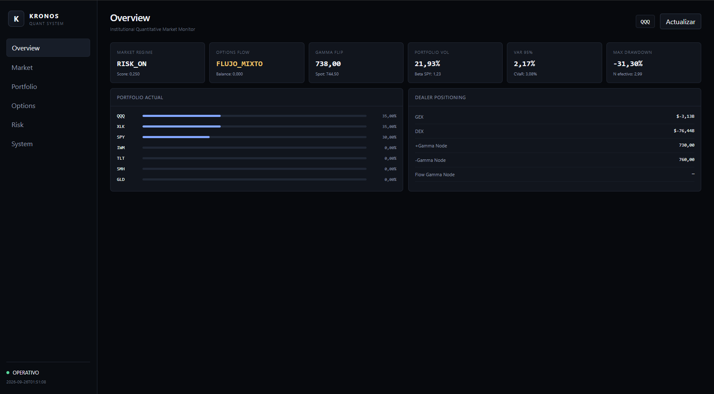
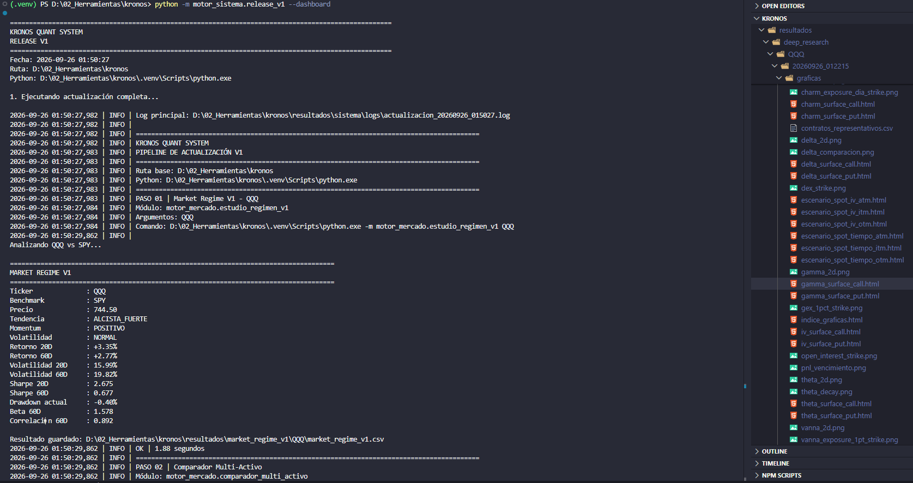
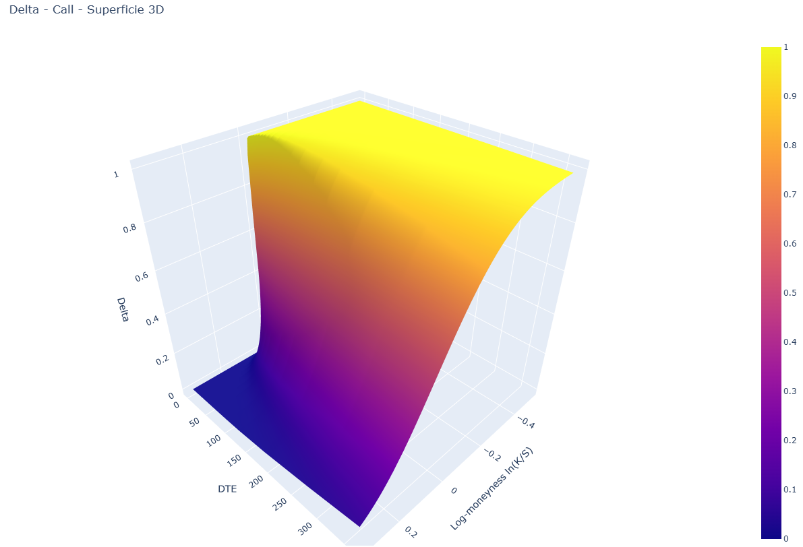
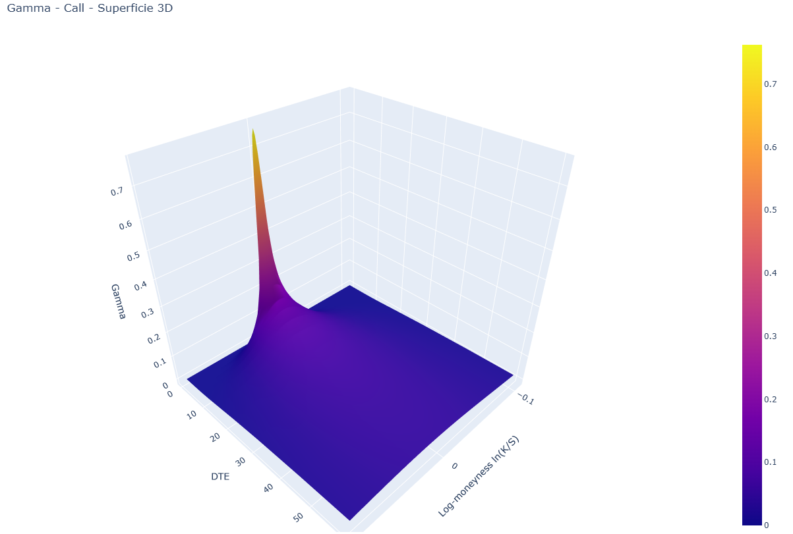
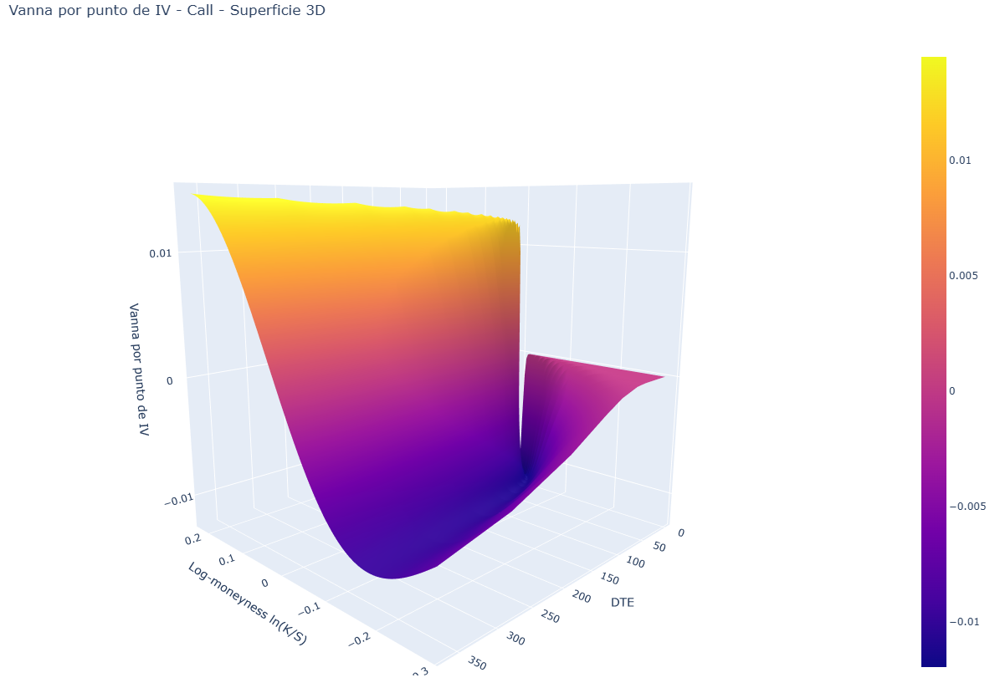

# Kronos Quant System — V1


Plataforma personal de **investigación cuantitativa, análisis de mercado, opciones, posicionamiento dealer, portfolio y riesgo** desarrollada en Python.

La V1 representa la primera versión completa y estable del sistema, construida principalmente alrededor de **QQQ y un universo multi-activo de referencia**, con integración de señales, modelos, opciones, riesgo, portfolio y visualización.

---

## Vista previa

### Dashboard V1



### Deep Research V1



### Delta Call — Superficie 3D



### Gamma Call — Superficie 3D



### Vanna Call — Superficie 3D



---

## Objetivo

El objetivo de Kronos Quant System es centralizar en una única plataforma distintas capas de análisis cuantitativo:

- Régimen de mercado
- Señales cuantitativas
- Forecasting
- Volatilidad
- Opciones
- Greeks
- Options Flow
- Dealer positioning
- Gamma Exposure
- Delta Exposure
- Vanna
- Charm
- Portfolio optimization
- Risk management
- Stress testing
- Visualización 2D y 3D

La plataforma está diseñada principalmente como herramienta de:

- investigación;
- experimentación;
- aprendizaje;
- análisis cuantitativo;
- desarrollo de estrategias.

---

# Arquitectura

```mermaid
flowchart TD

    DATA[Datos de mercado] --> MARKET[Motor de Mercado]
    DATA --> OPTIONS[Motor de Opciones]

    MARKET --> SIGNALS[Señales]
    MARKET --> FORECAST[Forecasting]
    MARKET --> REGIME[Régimen de Mercado]

    OPTIONS --> GREEKS[Greeks]
    OPTIONS --> FLOW[Options Flow]
    OPTIONS --> DEALER[Dealer Engine]

    GREEKS --> DEALER
    FLOW --> DEALER

    SIGNALS --> PORTFOLIO[Portfolio Engine]
    REGIME --> PORTFOLIO

    PORTFOLIO --> RISK[Risk Engine]

    FORECAST --> SYSTEM[Motor del Sistema]
    DEALER --> SYSTEM
    RISK --> SYSTEM

    SYSTEM --> DASHBOARD[Dashboard]