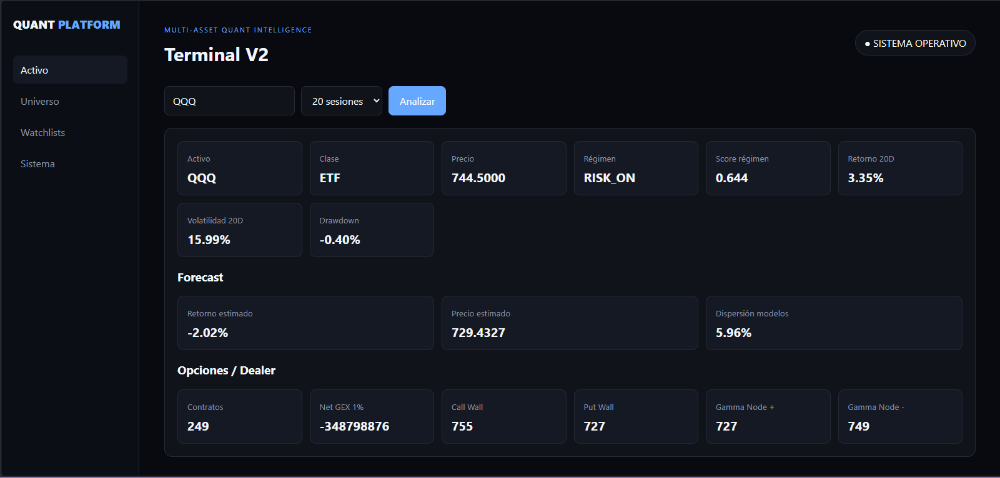
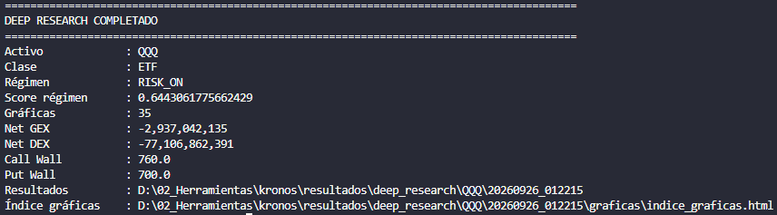
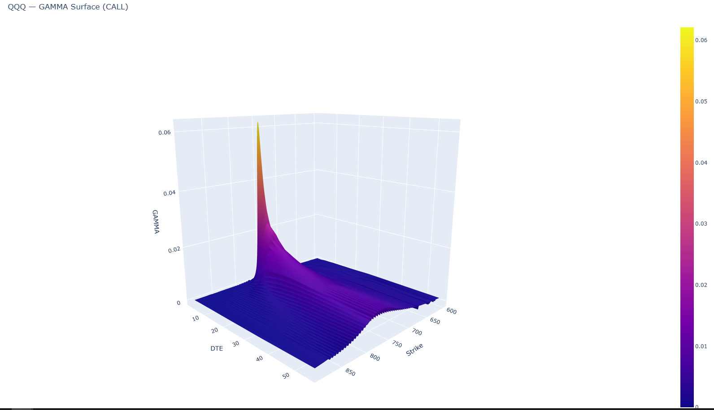
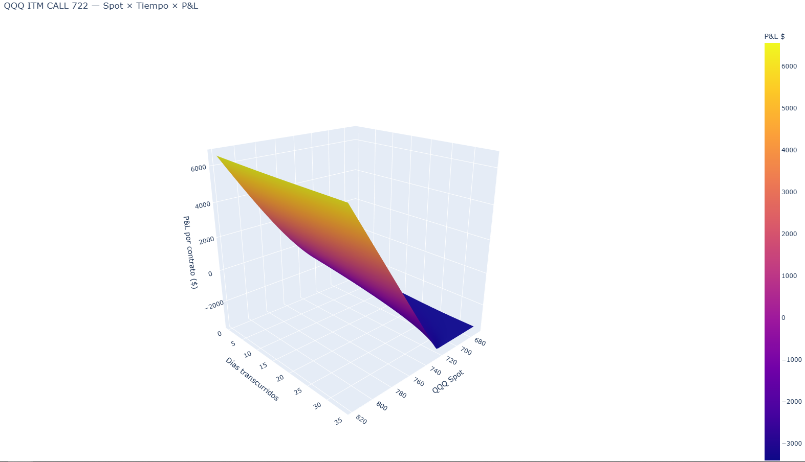
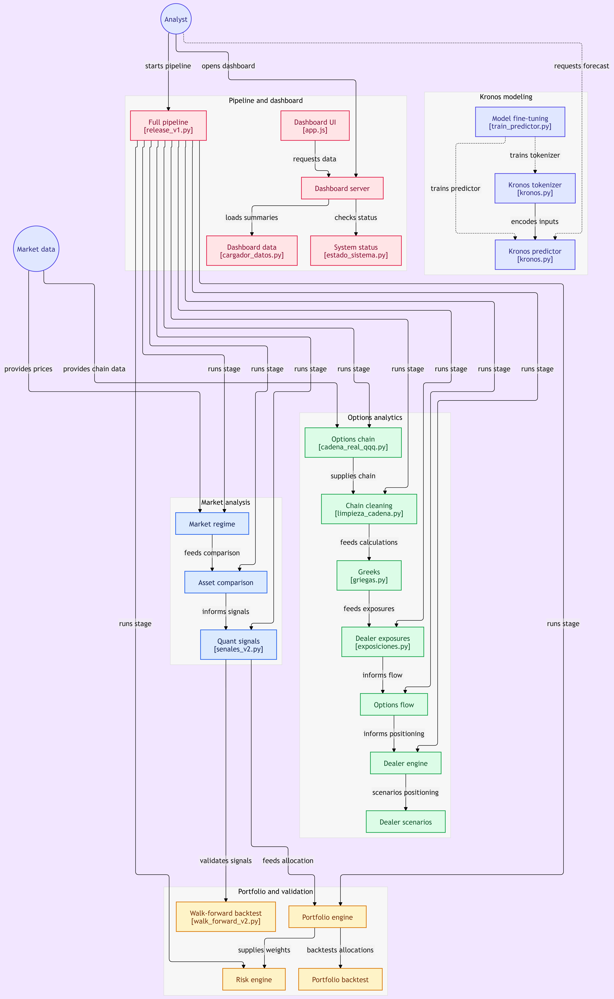

## Vista previa

### Dashboard V2



### Deep Research QQQ



### Gamma Surface 3D



### Scenario Engine — Spot × Tiempo × P&L



# how to use 
-Ejecutar pipeline completo
  python -m motor_sistema.release_v1

-Ejecutar pipeline y abrir dashboard
  python -m motor_sistema.release_v1 --dashboard

-Abrir únicamente el dashboard
  python -m dashboard.servidor_perspective

Dashboard:

http://127.0.0.1:8000

# Kronos Quant System

Sistema modular de análisis cuantitativo de mercados, portfolio, riesgo y opciones construido sobre Python y Kronos.

**Versión:** 1.0.0

## Descripción

Kronos Quant System integra en un único entorno:

- análisis de régimen de mercado;
- señales cuantitativas multi-activo;
- optimización de carteras;
- backtesting walk-forward;
- motor de riesgo;
- análisis de opciones;
- Greeks;
- Options Flow;
- posicionamiento dealer;
- escenarios de Gamma, Vanna y Charm;
- dashboard interactivo;
- pipeline completo automatizado.

El sistema está orientado principalmente al análisis de QQQ y de un universo de activos relacionados, aunque su arquitectura permite ampliar progresivamente el universo.

---

## Arquitectura

```text
Datos de mercado
      ↓
Market Regime V1 / V2
      ↓
Comparador Multi-Activo
      ↓
Signals V2
      ↓
Portfolio Engine V2
      ↓
Risk Engine V1
      ↓
Options Chain
      ↓
Greeks / Exposiciones
      ↓
Options Flow V2
      ↓
Dealer Engine V4
      ↓
Dashboard

